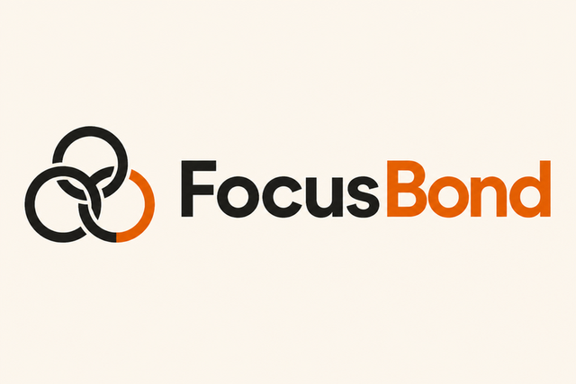
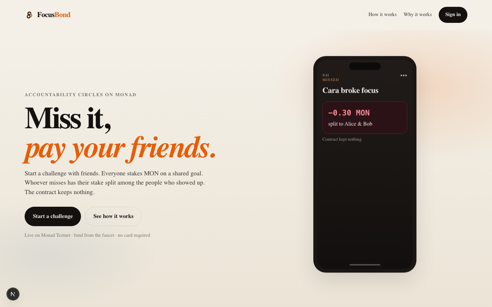
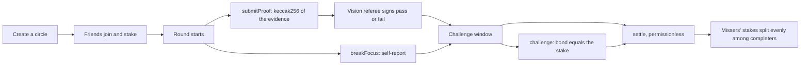
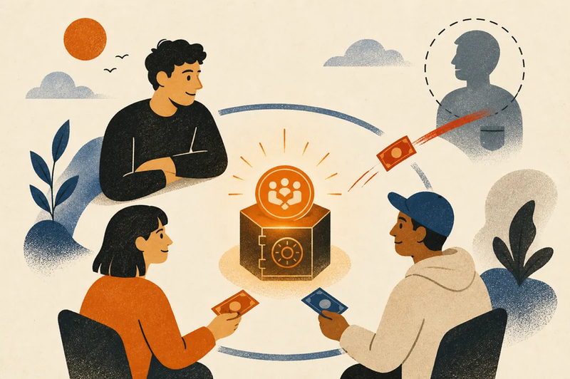
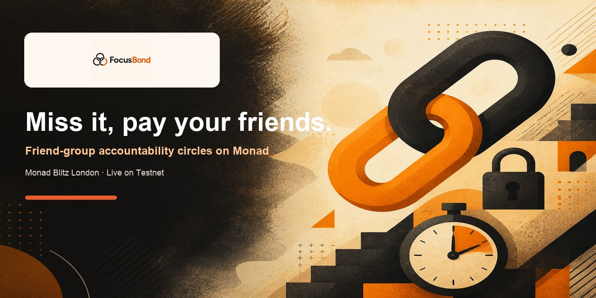

<p align="center">
  
</p>

<p align="center">
  <strong>Miss it, pay your friends.</strong><br />
  Friend-group accountability circles on <a href="https://www.monad.xyz/">Monad</a>.
</p>

<p align="center">
  <a href="https://monad-blitz-london.vercel.app"></a>
  <a href="https://testnet.monadscan.com/address/0x35059ddeB46e8b91b2860c16f71D9E4a0225c578"></a>
  <a href="https://www.monad.xyz/"></a>
</p>

<p align="center">
  
  
  
  
  
</p>

---

<p align="center">
  
</p>

**FocusBond** lets a friend group stake MON on a shared goal. Whoever misses has their entire stake split among the friends who showed up. The escrow contract takes no fee and cannot keep a single wei.

> Streek charges everyone's card and keeps the money. Forfeit charges your card and keeps the money. FocusBond escrows the group and pays the people who actually showed up.

**Live app:** [monad-blitz-london.vercel.app](https://monad-blitz-london.vercel.app)  
**Contract:** [`0x35059dde…c578`](https://testnet.monadscan.com/address/0x35059ddeB46e8b91b2860c16f71D9E4a0225c578) on Monad Testnet (`10143`)

Built at **Monad Blitz London**, 8 August 2026.

## Why it exists

Accountability products already charge you when you miss — but the money usually goes to the company. FocusBond flips that: the stake is peer-to-peer. Completers get paid. Missers fund them. Settlement is one onchain transaction.

Monad makes the consumer loop feel native: join, check in, attest, dispute, settle — lots of tiny txs plus an atomic multi-recipient payout, with sub-second blocks and negligible fees.

## How a round works



A completer submitted proof before the deadline, did not break focus, was not failed by the referee, and was not successfully disputed. Everyone else is a misser and forfeits their whole stake.

<p align="center">
  
</p>

## Product claims

| Claim | What it means |
| --- | --- |
| **No house cut** | Escrow drains to zero on every settle. Dust goes to the highest streak. |
| **Money only moves on failure** | Everyone completes → stakes refunded, streaks increment. |
| **Nobody completes?** | Collective fail — refunds, streaks reset. No fair recipient. |
| **Proof is a hash, not storage** | Image is hashed in-browser; never persisted. Content checking is the referee's job. |
| **Referee is a shield, challenge is a sword** | Valid pass defeats a dispute; false accusers forfeit their bond. |
| **`settle` is permissionless** | Anyone can trigger payout after the challenge window — app uptime not required. |
| **Hostile member can't freeze the group** | Failed push payments credit `withdrawable` instead of reverting settlement. |
| **Gas on the limit** | Member count capped at 8; frontend sends measured gas limits (Monad charges the limit). |

## Demo script (3 minutes)

1. Three wallets join a Blitz Lock-In circle at 0.1 MON each. Show the escrow on the explorer.
2. Start a 60-second round.
3. Alice uploads a genuine screenshot; the referee passes it. Bob checks in too. Cara uploads a cat photo and the referee rejects it.
4. Settle. Cara's whole stake splits to Alice and Bob in one transaction. Open the `Settled` event — contract kept nothing.
5. Streaks rise for Alice and Bob, reset for Cara; dashboard shows net earnings.

`scripts/e2e-testnet.sh` drives the same arc from the terminal.

## Repo layout

```
contracts/    Foundry project: FocusBond.sol, tests, deploy script
web/          Next.js app — landing + challenge console (viem / wagmi / Para)
scripts/      fund.sh and full testnet end-to-end run
docs/         Competitive landscape + README assets
screenshots/  Capture of the live UI
```

## Quickstart

Requires the Monad Foundry toolchain and Node 20+.

```bash
# 1. contracts
cd contracts
forge test                      # settlement paths + zero-balance invariants

# 2. wallets and funding
#    .env holds DEPLOYER / REFEREE / ALICE / BOB / CARA keys (gitignored)
#    fund DEPLOYER from https://faucet.monad.xyz then:
./scripts/fund.sh

# 3. deploy
cd contracts
forge script script/Deploy.s.sol --rpc-url https://testnet-rpc.monad.xyz --broadcast
#    put the address in .env as NEXT_PUBLIC_FOCUSBOND_ADDRESS

# 4. app
cd web && npm install && npm run dev    # http://localhost:3000
```

Copy [.env.example](.env.example) → `.env`. The frontend holds no private keys: the browser reads the chain directly and asks a server route to act as demo actors when needed.

### AI referee

| `REFEREE_MODE` | Behaviour |
| --- | --- |
| `auto` (default) | Vision model when `OPENAI_API_KEY` is set, else filename heuristic |
| `ai` | Prefer the model; timeout/API error degrades to heuristic |
| `heuristic` | Filename only |
| `off` | No verdicts — onchain challenge window is the only arbiter |

The referee can never block a check-in. Missing keys, timeouts, and API errors degrade to a weaker verdict. The UI labels the source so a heuristic result is never mistaken for real verification.

## Testing

```bash
forge test
```

Covers: everyone completes, a misser paying completers, a referee fail slashing, a false dispute forfeiting its bond, a successful dispute, collective-fail refund, dust never sticking, a hostile receiver not blocking settlement, plus guards on joining after start, double settlement, and forged referee signatures.

Every settlement test asserts the contract balance is zero afterwards. That assertion is the product claim.

## Deployment

| | |
| --- | --- |
| Network | Monad Testnet (`10143`) |
| FocusBond | [`0x35059ddeB46e8b91b2860c16f71D9E4a0225c578`](https://testnet.monadscan.com/address/0x35059ddeB46e8b91b2860c16f71D9E4a0225c578) |
| Referee | `0x1EfCf93D60Cd5cF550A22AaEb8a86fc9805D56EC` |
| App | https://monad-blitz-london.vercel.app |
| Explorer | https://testnet.monadscan.com |

Verified end to end on Testnet with `scripts/e2e-testnet.sh`. Three friends staked 0.3 MON each, Cara broke focus, and her whole stake split to Alice and Bob in a single `settle`:

| | Before | After | Change |
| --- | --- | --- | --- |
| Alice | 1.7131 | 1.7954 | +0.082 |
| Bob | 0.8927 | 1.0222 | +0.129 |
| Cara | 0.7908 | 0.4712 | −0.320 |
| Escrow | 0.9 | **0** | contract retained nothing |

Monad-specific lessons from that run:

- Gas is charged on the **limit**, so padded limits are money spent. Ours came down to measured maximums from `forge test --gas-report`.
- Settlement is permissionless — have whoever missed trigger `settle`, so winners are not paying gas for their own payout.

## Prior art

We researched the category before building; see [docs/LANDSCAPE.md](docs/LANDSCAPE.md) for how [Streek](https://www.getstreek.com/), [Nudge](https://getnudge.net/), [Forfeit](https://www.forfeit.app/), stickK, Beeminder and others handle stakes — and the gap FocusBond targets: weekly group goals with proof review and a genuine peer-to-peer payout, with no custodian.

---

<p align="center">
  
  <br />
  <sub>Built at Monad Blitz London · Encode Hub · August 2026</sub>
</p>
