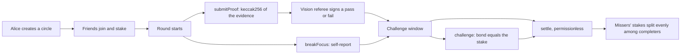

# FocusBond — miss it, pay your friends

**Friend-group accountability circles on Monad. Everyone stakes MON on a shared goal; whoever misses has their entire stake split among the friends who showed up. The contract takes no fee and cannot keep a single wei.**

Built at Monad Blitz London, 8 August 2026.

> Streek charges everyone's card and keeps the money. Forfeit charges your card and keeps the money. FocusBond escrows the group and pays the people who actually showed up. Venmo can request five dollars; it cannot do this.

## Why Monad

Accountability is a high-frequency money game: join, check in, attest, nudge, dispute, slash, settle. That is a lot of tiny transactions per person per day, plus a settlement that pays several recipients atomically. Sub-second blocks and negligible fees are what make it feel like a consumer app rather than a gas nightmare — nudges are onchain precisely because here they are effectively free.

- Chain: Monad Testnet, chain id `10143`
- Contract: `FocusBond.sol` — see [Deployment](#deployment)

## How a round works



A completer submitted a proof before the deadline, did not break focus, was not
failed by the referee, and was not successfully disputed. Everyone else is a
misser and forfeits their whole stake.

## Design decisions worth knowing

- **A circle is one round.** A week of accountability is just repeated circles. This removed a large amount of state and edge cases.
- **Money only moves on failure.** If everyone completes, everyone simply gets their stake back and their streak increments.
- **Nobody completes?** No redistribution — stakes are refunded and every streak resets, because there is no fair recipient. Emits `CollectiveFail`.
- **Rounding dust** goes to the completer with the highest streak, ties broken by lowest member index, so the escrow always drains to zero.
- **The referee is a shield, the challenge is a sword.** A valid referee pass defeats a dispute and the accuser forfeits their bond to the accused. An unattested check-in loses to a dispute. No voting, no human judge.
- **What the proof hash proves.** It is `keccak256` of the image bytes: a timestamped commitment that you held that exact file before the deadline. It does **not** prove the file shows what you claim. Content checking is the referee's job, and we would rather say that than imply otherwise.
- **The image is never stored.** It is hashed in your browser and, if you use the referee, judged in memory. Nothing is persisted and nothing goes onchain but the hash.
- **`settle` is permissionless.** Once the challenge window closes anyone can trigger the payout, so it does not depend on our app being online.
- **One hostile member cannot freeze the group.** A failed push payment is credited to `withdrawable` instead of reverting the whole settlement.
- **Gas on the limit.** Monad charges the gas limit rather than usage, so member count is capped at 8, every loop is bounded by it, and the frontend sends deliberate limits.

## Repo layout

```
contracts/    Foundry project: FocusBond.sol, tests, deploy script
web/          Next.js demo console and dashboard (viem)
scripts/      fund.sh and a full testnet end-to-end run
docs/         Competitive landscape research
```

## Quickstart

Requires the Monad Foundry toolchain and Node 20+.

```bash
# 1. contracts
cd contracts
forge test                      # 15 tests, all settlement paths

# 2. wallets and funding
#    .env holds DEPLOYER / REFEREE / ALICE / BOB / CARA keys (gitignored)
#    fund DEPLOYER from https://faucet.monad.xyz then:
./scripts/fund.sh

# 3. deploy
cd contracts
forge script script/Deploy.s.sol --rpc-url https://testnet-rpc.monad.xyz --broadcast
#    put the address in .env as NEXT_PUBLIC_FOCUSBOND_ADDRESS

# 4. app
cd web && npm install && npm run dev    # http://localhost:3000
```

The frontend holds no private keys: the browser reads the chain directly and asks
a server route to act as Alice, Bob, or Cara.

### AI referee

Start from [.env.example](.env.example). Set `OPENAI_API_KEY` to enable real
vision verification of screenshots, and use `REFEREE_MODE` to choose how strict
the pipeline is:

| `REFEREE_MODE` | Behaviour |
| --- | --- |
| `auto` (default) | Use the vision model when a key is set, otherwise fall back to the filename heuristic |
| `ai` | Prefer the model; a timeout or API error degrades to the heuristic |
| `heuristic` | Skip the model entirely and judge on the filename |
| `off` | Issue no verdicts at all, leaving the onchain challenge window as the only arbiter |

The referee can never block a check-in. A missing key, a timeout, or an API error
degrades to a weaker verdict rather than a failed check-in, and the UI always
labels which source produced the verdict so a heuristic result is never mistaken
for real verification. In heuristic mode the bonded peer challenge is the actual
defence.

## Testing

```
forge test
```

Covers: everyone completes, a misser paying completers, a referee fail slashing,
a false dispute forfeiting its bond, a successful dispute, the collective-fail
refund, dust never sticking, a hostile receiver not blocking settlement, plus
guards on joining after start, double settlement, and forged referee signatures.

Every settlement test asserts the contract's balance is zero afterwards. That
assertion is the product claim.

## Demo script (3 minutes)

1. Three wallets join a Blitz Lock-In circle at 0.1 MON each. Show the escrow on the explorer.
2. Start a 60-second round.
3. Alice uploads a genuine screenshot; the referee passes it and the hash lands onchain. Bob checks in too. Cara uploads a cat photo and the referee rejects it.
4. Settle. Cara's whole stake splits to Alice and Bob in one transaction; the balances jump on screen. Open the `Settled` event and point out the contract kept nothing.
5. Streaks rise for Alice and Bob, reset for Cara, and the dashboard shows net earnings.

`scripts/e2e-testnet.sh` drives the same arc from the terminal as a fallback.

## Deployment

| | |
| --- | --- |
| Network | Monad Testnet (`10143`) |
| FocusBond | [`0x35059ddeB46e8b91b2860c16f71D9E4a0225c578`](https://testnet.monadscan.com/address/0x35059ddeB46e8b91b2860c16f71D9E4a0225c578) |
| Referee | `0x1EfCf93D60Cd5cF550A22AaEb8a86fc9805D56EC` |
| Explorer | https://testnet.monadscan.com |

Verified end to end on Testnet with `scripts/e2e-testnet.sh`. Three friends staked
0.3 MON each, Cara broke focus, and her whole stake split to Alice and Bob in a
single `settle` transaction:

| | Before | After | Change |
| --- | --- | --- | --- |
| Alice | 1.7131 | 1.7954 | +0.082 (0.15 share, less gas for four transactions) |
| Bob | 0.8927 | 1.0222 | +0.129 (0.15 share, less gas for two transactions) |
| Cara | 0.7908 | 0.4712 | -0.320 (forfeited stake plus gas) |
| Escrow | 0.9 | **0** | contract retained nothing |

An earlier run with too short a round also exercised the single-completer path by
accident: Bob's check-in missed the deadline, so Alice was the only completer and
correctly collected both forfeited stakes.

Two things that run taught us, both Monad-specific:

- Because gas is charged on the **limit**, padded limits are money spent rather
  than headroom. Ours came down to measured maximums from `forge test
  --gas-report`, which cut the cost of a round substantially.
- Settlement is permissionless, so the app has whoever missed trigger `settle`.
  Otherwise the winners pay the gas for the payout that rewards them.

## Prior art

We researched the category before building; see [docs/LANDSCAPE.md](docs/LANDSCAPE.md)
for how [Streek](https://www.getstreek.com/), [Nudge](https://getnudge.net/),
[Forfeit](https://www.forfeit.app/), stickK, Beeminder and others handle stakes,
and the specific gap FocusBond targets: weekly group goals with proof review and
a genuine peer-to-peer payout, with no custodian.
